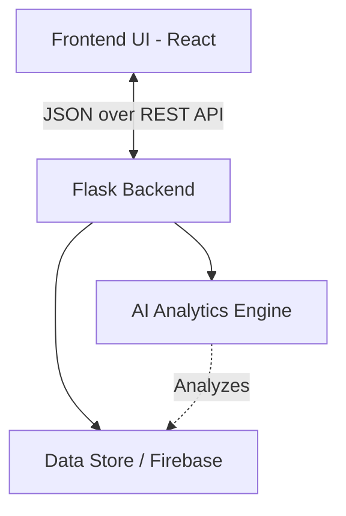

# RetailGuard Technical Workflow

This document outlines the complete technical architecture and data workflow of the **RetailGuard POS & Loss Prevention System**.

## 1. System Architecture Overview

RetailGuard is constructed as a decoupled, full-stack application built for small-to-medium retail owners.

*   **Frontend**: React.js (Vite), utilizing React Router for SPA navigation, `react-i18next` for multilingual support, and Recharts for dynamic dashboard analytics.
*   **Design System**: A custom CSS variable-driven "Light Fintech" theme focusing on solid high-contrast components and a strict 8px spacing grid.
*   **Backend**: Python Flask REST API serving as both the data resolution layer and the AI Analytics Engine.

---

## 2. Core Workflows

### A. Point of Sale (POS) Checkout Flow
The POS system handles direct customer billing with integrated credit (Khata) tracking and fractional split-payments.

1.  **Cart Assembly**: User selects items. `Inventory.jsx` metrics are queried to ensure stock availability. Out-of-stock items are disabled.
2.  **Customer Binding**: A customer is selected, optionally pulling their historic pending Khata balance. Local state manages the assigned customer per item.
3.  **Payment Allocation**: Cash, UPI, Split, or Khata is selected. If "Split" is chosen, the engine validates that the sum of parts exactly matches the cart total.
4.  **Transaction Committal**: `api.addTransaction()` is invoked asynchronously, pushing structured JSON payload containing `{ date, items, amount, paymentType, status: 'completed' }` to the data layer.
5.  **Receipt Generation**: Upon a successful JSON response, a printable HTML table receipt is appended to the DOM and instantiated as a temporary Blob URL for immediate printing/downloading.

### B. Inventory & Catalog Data Flow
Inventory relies on real-time data binding to prevent stock-outs.

1.  **Read**: Component mounts pull the catalog via `api.getInventory()`, calculating total retail value dynamically based on `stock * price`.
2.  **Write/Mutate**: The frontend dispatches `api.updateInventoryItem()` or `api.addInventoryItem()` carrying JSON mutations payload. The backend instantly recalculates the item's overarching status (`low_stock` or `out_of_stock`).

### C. AI Engine & Insights Workflow (Flask Backend)
The true power of RetailGuard resides in the Flask backend's continuous analytic cycles, returning actionable insights array to the React Dashboard.

1.  **Z-Score Anomaly Detection**: `detect_anomalies()` sweeps the transaction store. It computes the active standard deviation of all transaction amounts. Any `TXN` exceeding a z-score of `1.5` is surfaced as an unusually high or low transaction.
2.  **Stock Shortage Prediction**: `analyze_stock_shortages()` correlates current `stock` against `dailySales` velocity. It flags any item with a runway of `≤ 3 days` as an emergency restock alert, assigning confidence intervals.
3.  **Payment Audits**: `analyze_payment_mismatches()` intercepts the `payments` matrix, strictly contrasting the `expected` POS rung-amount against the `received` verified amount. Deficits branch into `mismatch` status alerts.
4.  **Dashboard Aggregation**: All anomalies, shortages, and mismatches are clustered via the `/api/insights` endpoint, sorted by integer-based severity mapping, and ferried to the UI's `StatsCard` and `AlertCard` components.

---

## 3. Data Entities

> [!IMPORTANT]
> The current system data binds against mocked arrays in `api.js` and `app.py`. For production scaling, these structured payloads mirror **Firebase Firestore** or **MongoDB** document schemas.

*   **Transactions**: Central ledger recording items sold and revenue aggregated.
*   **Payments**: Independent ledger tracking *how* money moved (UPI Ref, Cash) and validating fidelity against Transactions.
*   **Inventory**: Catalog definitions containing velocity metrics (`dailySales`) which drive the AI engine.

## 4. Frontend Component Routing

| Route | Component | Responsibilities |
| :--- | :--- | :--- |
| `/` | `Dashboard.jsx` | Mounts Recharts over `/api/sales-data` and renders AI Alerts. |
| `/pos` | `POS.jsx` | Calculates cart logic, split-math validation, and commits orders. |
| `/inventory` | `Inventory.jsx` | Handles CRUD ops for products and updates stock thresholds. |
| `/insights` | `Insights.jsx` | Renders parsed data from the backend AI scripts. |
| `/settings` | `Settings.jsx` | Adjusts global localization (Hindi/Kannada/English). |
